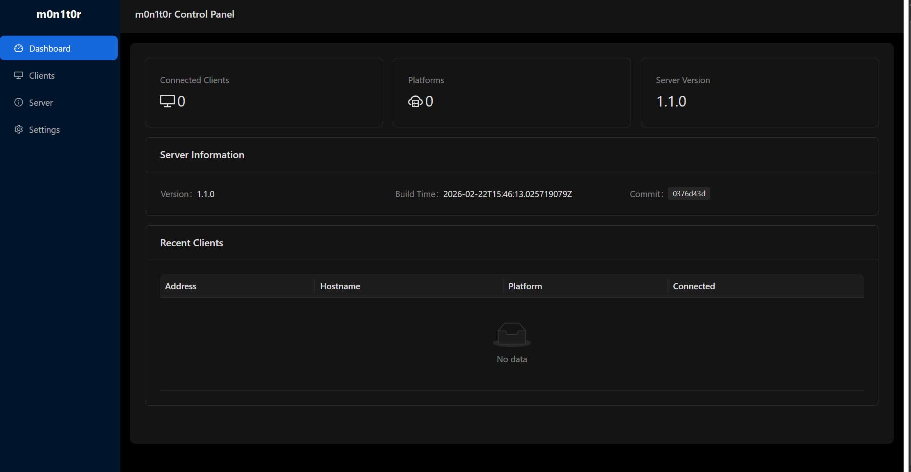

# m0n1t0r

[](https://github.com/MMitsuha/m0n1t0r/actions/workflows/build.yml)
[](https://github.com/MMitsuha/m0n1t0r/actions/workflows/docker.yml)

A high-performance, cross-platform command and control framework for red teams, written in Rust.

## Features

- **File Operations** — Browse, upload, download, and delete files on remote clients
- **Remote Desktop** — Real-time screen capture with multi-display and quality control (VP9/RGB/MPEG1/YUV)
- **Interactive Shell** — Execute commands and spawn interactive terminal sessions
- **SOCKS5 Proxy** — Create SOCKS5 proxies (no-auth / password) and TCP port forwards through clients
- **Process Management** — List, kill, and execute processes (blocked or detached)
- **Client Update** — Push binary updates to connected clients via URL or file upload
- **Web UI** — React-based admin dashboard for managing all connected clients
- **RESTful API** — Full-featured HTTP API with WebSocket support for real-time streaming
- **TLS Encryption** — All client-server communications secured with certificate-pinned TLS
- **Cross-Platform** — Supports Windows, Linux, and macOS

## Architecture

```
m0n1t0r/
├── m0n1t0r-server/    # C2 server — Actix-web API + client connection listener
├── m0n1t0r-client/    # Agent — connects back to server over TLS
├── m0n1t0r-common/    # Shared types, RPC definitions, and utilities
├── m0n1t0r-ui/        # React + TypeScript web dashboard
├── m0n1t0r-build/     # Build-time helpers (cert generation)
├── m0n1t0r-macro/     # Procedural macros
├── xtask/             # Build tasks (cargo xtask)
├── certs/             # Generated TLS certificates
└── deps/              # Vendored dependencies
```

The server exposes two listeners:

| Listener | Default Address | Purpose |
|----------|----------------|---------|
| Connection | `0.0.0.0:27853` | Accepts TLS connections from agents |
| API | `0.0.0.0:10801` | REST API + WebSocket endpoints for the web UI |

Communication between server and clients uses **remoc** (async RPC with MessagePack) over **TLS** (rustls). The CA certificate is embedded in the client binary at compile time.

## Prerequisites

- **Rust** >= 1.85 (edition 2024)
- **vcpkg** with packages: `libvpx`, `libyuv`, `opus`, `aom`, `ffmpeg` (+ `mfx-dispatch` on Linux/Windows)
- **xmake** — for C++ dependency builds
- **cxxbridge-cmd** — `cargo install cxxbridge-cmd`
- **FFmpeg** development libraries
- **Node.js / Bun** — for building the web UI (optional)

## Environment Variables

The following must be set at **build time** (or via a `.env` file):

| Variable | Description |
|----------|-------------|
| `M0N1T0R_DOMAIN` | Server hostname — baked into client binary and used as TLS cert CN/SAN |
| `M0N1T0R_SECRET` | Session cookie signing key for the API server |
| `M0N1T0R_COUNTRY` | TLS certificate subject — Country (C) |
| `M0N1T0R_STATE` | TLS certificate subject — State (ST) |
| `M0N1T0R_LOCALITY` | TLS certificate subject — Locality (L) |
| `M0N1T0R_ORG` | TLS certificate subject — Organization (O) |
| `M0N1T0R_UNIT` | TLS certificate subject — Organizational Unit (OU) |

## Build

### 1. Generate TLS Certificates

```bash
cargo xtask -c
```

This generates a self-signed CA and end-entity certificate under `certs/`. The CA certificate is embedded into the client binary during compilation.

### 2. Build Server & Client

#### Ubuntu

```bash
sudo add-apt-repository ppa:xmake-io/xmake
sudo apt update
sudo apt install -y zip g++ gcc git curl wget nasm yasm libgtk-3-dev clang \
  libxcb-randr0-dev libxdo-dev libxfixes-dev libxcb-shape0-dev libxcb-xfixes0-dev \
  libasound2-dev libpulse-dev cmake make libclang-dev ninja-build \
  libgstreamer1.0-dev libgstreamer-plugins-base1.0-dev libpam0g-dev xmake pkg-config \
  libavutil-dev libavcodec-dev libavdevice-dev libavfilter-dev libavformat-dev \
  libswresample-dev libswscale-dev autoconf libtool

git clone https://github.com/microsoft/vcpkg
./vcpkg/bootstrap-vcpkg.sh
export VCPKG_ROOT=$PWD/vcpkg
./vcpkg/vcpkg install libvpx libyuv opus aom mfx-dispatch ffmpeg

cargo install cxxbridge-cmd
cargo xtask -c
cargo build --bin m0n1t0r-server --features linux -r
cargo build --bin m0n1t0r-client --features linux -r
```

#### Windows

```powershell
git clone https://github.com/microsoft/vcpkg
./vcpkg/bootstrap-vcpkg.bat
$env:VCPKG_ROOT = "$PWD/vcpkg"
./vcpkg/vcpkg install libvpx:x64-windows-static libyuv:x64-windows-static `
  opus:x64-windows-static aom:x64-windows-static `
  mfx-dispatch:x64-windows-static ffmpeg:x64-windows-static

scoop install main/xmake
cargo install cxxbridge-cmd
cargo xtask -c
cargo build --bin m0n1t0r-server --features winnt -r
cargo build --bin m0n1t0r-client --features winnt -r
```

#### macOS

```zsh
brew install binutils meson nasm ninja autoconf automake autoconf-archive \
  python3 libtool cmake gcc wget pkg-config libresample ffmpeg xmake

git clone https://github.com/microsoft/vcpkg
./vcpkg/bootstrap-vcpkg.sh
export VCPKG_ROOT=$PWD/vcpkg
./vcpkg/vcpkg install libvpx libyuv opus aom ffmpeg

cargo install cxxbridge-cmd
cargo xtask -c
cargo build --bin m0n1t0r-server --features macos -r
cargo build --bin m0n1t0r-client --features macos -r
```

### 3. Build Web UI (Optional)

```bash
cd m0n1t0r-ui
bun install
bun run build
```

The built files are output to `m0n1t0r-ui/dist/` and can be served by the API server or any static file server.

### Platform Feature Flags

A platform feature **must** be specified at build time:

| Feature | Platform |
|---------|----------|
| `linux` | Linux |
| `winnt` | Windows |
| `winnt-uac` | Windows with UAC elevation (client only) |
| `macos` | macOS |

## Docker

The quickest way to run the server and web UI together:

```bash
docker compose up --build
```

This builds a multi-stage image that compiles the server, builds the UI, and packages everything into a minimal Debian runtime with nginx as a reverse proxy.

| Port | Service |
|------|---------|
| `80` | Web UI (nginx) |
| `27853` | Client TLS connections |

TLS certificates are auto-generated during the build. To use your own, mount them as a volume:

```bash
docker compose run -v ./certs:/app/certs m0n1t0r
```

## Usage

### Start the Server

```bash
m0n1t0r-server \
  --conn-addr 0.0.0.0:27853 \
  --api-addr 0.0.0.0:10801 \
  --key certs/end.key \
  --cert certs/end.crt
```

| Flag | Default | Description |
|------|---------|-------------|
| `--conn-addr` | `0.0.0.0:27853` | Address for client connections |
| `--api-addr` | `0.0.0.0:10801` | Address for the REST/WebSocket API |
| `--key` | *(required)* | Path to TLS private key PEM |
| `--cert` | *(required)* | Path to TLS certificate PEM |
| `--use-https` | `true` in release | Enable HTTPS for the API |
| `--log-level` | `debug` | Log verbosity level |

### Deploy the Client

The client binary requires no arguments. The server address is baked in at compile time via `M0N1T0R_DOMAIN`. It connects to port `27853` and automatically reconnects every 10 seconds on failure.

On Windows, the client runs as a hidden process (no console window).

## API Documentation

The server exposes a RESTful API at `/api/v1/` with WebSocket endpoints for real-time features.

For the full API reference, see [**API Documentation**](m0n1t0r-server/src/web/api/README.md).

### Quick Reference

| Endpoint | Description |
|----------|-------------|
| `GET /api/v1/client` | List connected clients |
| `GET /api/v1/client/{addr}` | Get client details |
| `GET /api/v1/client/{addr}/fs?path=` | Browse filesystem |
| `GET /api/v1/client/{addr}/process` | List processes |
| `GET /api/v1/client/{addr}/process/interactive` | Interactive shell (WebSocket) |
| `GET /api/v1/client/{addr}/rd` | List displays |
| `GET /api/v1/client/{addr}/rd/stream/rgb` | Remote desktop stream (WebSocket) |
| `POST /api/v1/client/{addr}/proxy/socks5/noauth` | Create SOCKS5 proxy |
| `GET /api/v1/server/notification` | Connection events (WebSocket) |

## Screenshots



## License

`m0n1t0r` is distributed under the GPLv3 license. The software comes with absolutely no warranty.
